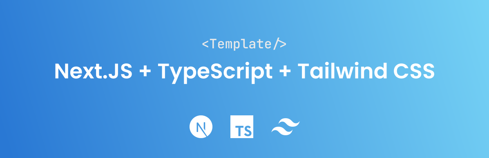

<h1 align="center">next-typescript-tailwindcss-template</h1>



⚡ Simplistic [Next.js](https://nextjs.org) + [TypeScript](https://www.typescriptlang.org/) + [Tailwind CSS](https://tailwindcss.com/) website template.

## Features

* Next.js
* TypeScript
* Tailwind CSS
* svgr
* ESLint
  * Next.js core web vitals 
  * Prettier rules
* Prettier
  * Tailwind CSS plugin
* Path aliases

## Getting Started
You can use any package manager of your choice, but [pnpm](https://pnpm.io) is preferred.
### Installing
```bash
pnpm install # or yarn install, npm install, etc.
```
### Development
This command starts the built-in next development server.
```bash
pnpm dev
```
### Building for production
This command builds your server into a production-ready state.
```bash
pnpm build
```
### Start the production server
This command starts your pre-built server and hosts it on localhost:3000 (the port depends on your port variable)
```bash
pnpm start
```
